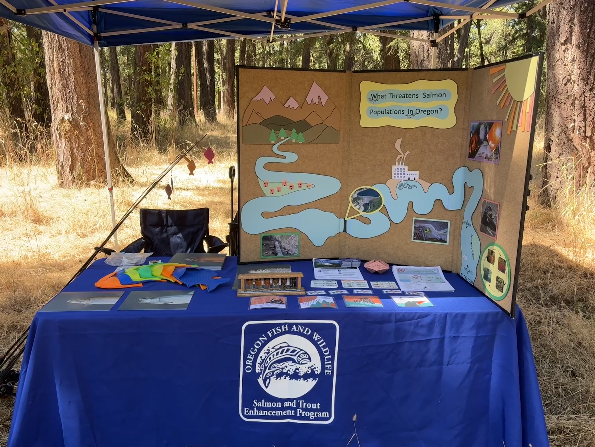

## Biological & Wildlife Surveys
As a **Biological Science Assistant** with the **Oregon Department of Fish and Wildlife**, I conduct specialized surveys to monitor local aquatic populations.

### **Survey Techniques**
* **Electroshock Fishing**: Utilized standardized techniques for population sampling.
* **Temperature Monitoring**: Deployed and managed data loggers for habitat thermal analysis.
* **Observation & Monitoring**: Conducted snorkel observations and winter steelhead redd (nest) monitoring.
* **Stock Management**: Processed adult salmon for release above the **Alsea River** dam and monitored rainbow trout health.

{{< carousel 
    images="{fish1.jpeg,fish2.jpeg,fish3.jpeg,fish4.JPG}" 
    aspectRatio="3-4" 
    interval="1500" 
>}}

### **Data & Reporting**
* Authored biological reports following electroshocking surveys.
* Managed  data entry for all field survey results to ensure high-quality environmental datasets.

---
## Community Education & Outreach
Beyond technical field work, I lead initiatives to communicate fisheries science to the public.

* **Scientific Education**: Led 25+ outreach events for community groups and elementary schools, covering topics from salmon dissections to tree planting.
* **Interactive Communication**: Developed a custom educational board to communicate major threats to **Oregon's** salmonid populations.

*Figure 1: ODFW educational booth at a community outreach event.*

Additionally, I supported the Eggs to Fry program for dozens of schools in the Willamette Valley, and built this interactive map to show the program impact and release locations: 

<iframe src="https://www.google.com/maps/d/u/0/embed?mid=1wMtzWyDJjLz73NkhzJYPIFJ_ktEpx48&ehbc=2E312F&noprof=1" width="640" height="480"></iframe>