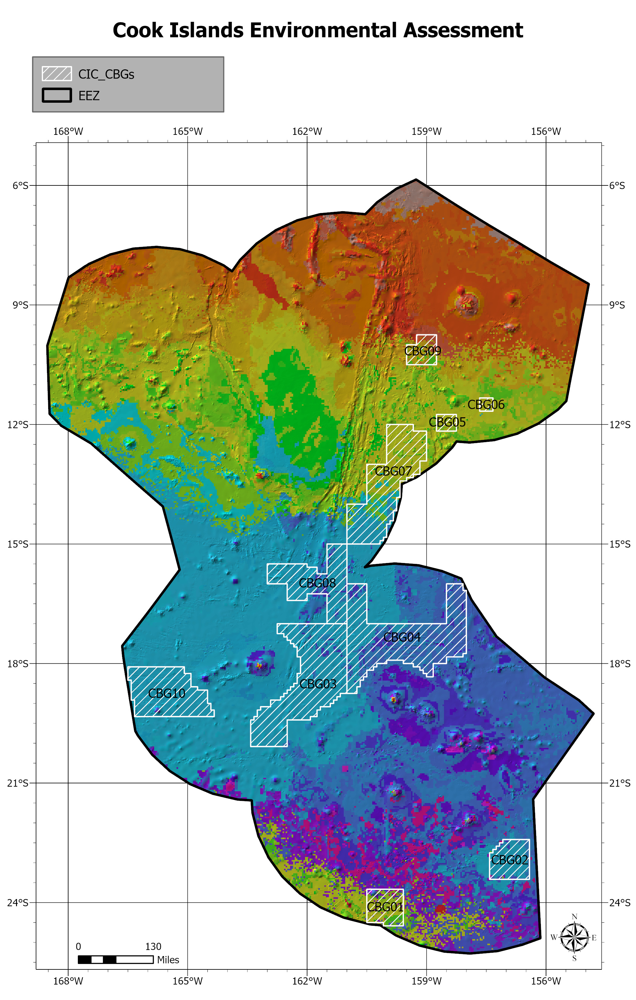

## Assessment Overview
This project involved a creating comprehensive spatial assessment of a proposed deep sea mining site near the Cook Islands’ Exclusive Economic Zone (EEZ). I utilized **ArcGIS Pro** to map bathymetry and bathymetry-derived variables as well as a complete assesment and habitat classification of the area.  

## **Spatial Data Visualizations**
Here are the primary outputs from the **ArcGIS Pro** analysis:

*Figure 1: Spatial distribution of key marine habitat types.*

*Figure 2: Analysis of study area bathymetry.*

---

## Impact
* Delivered accurate and peer reviewed analysis for the client, providing them with the needed documentation for regulatory bodies. 